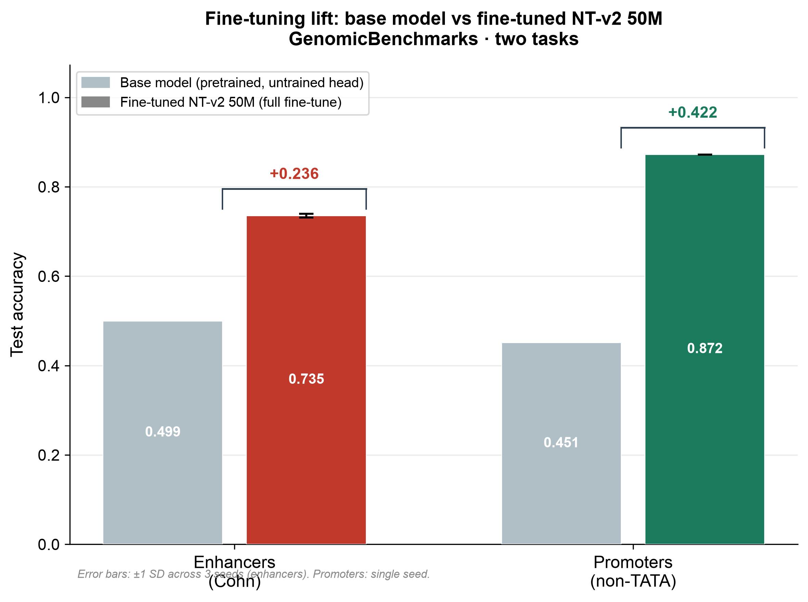
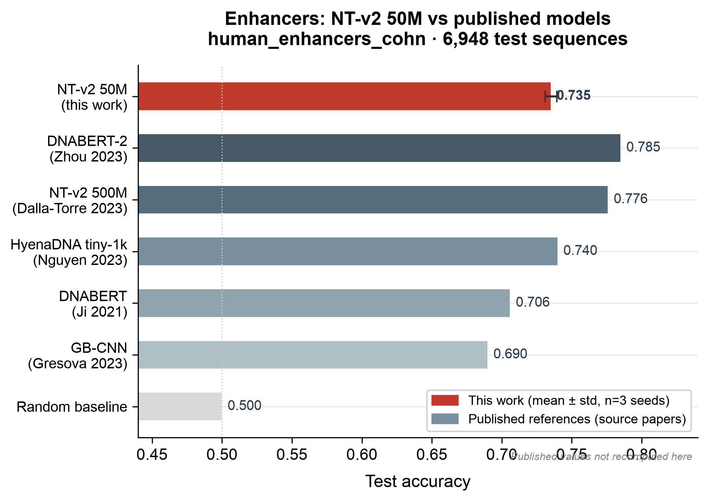
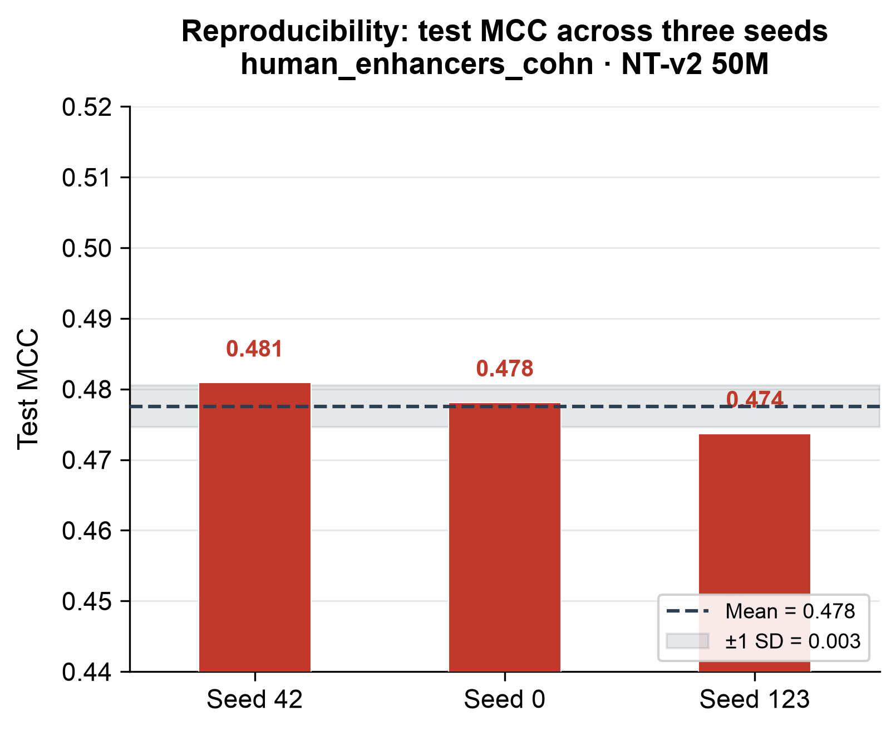
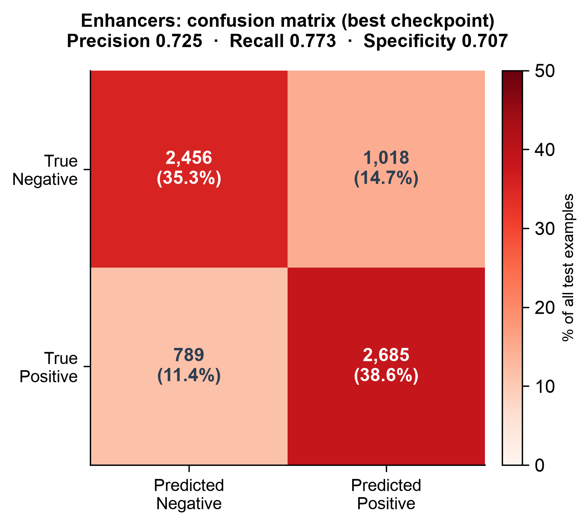
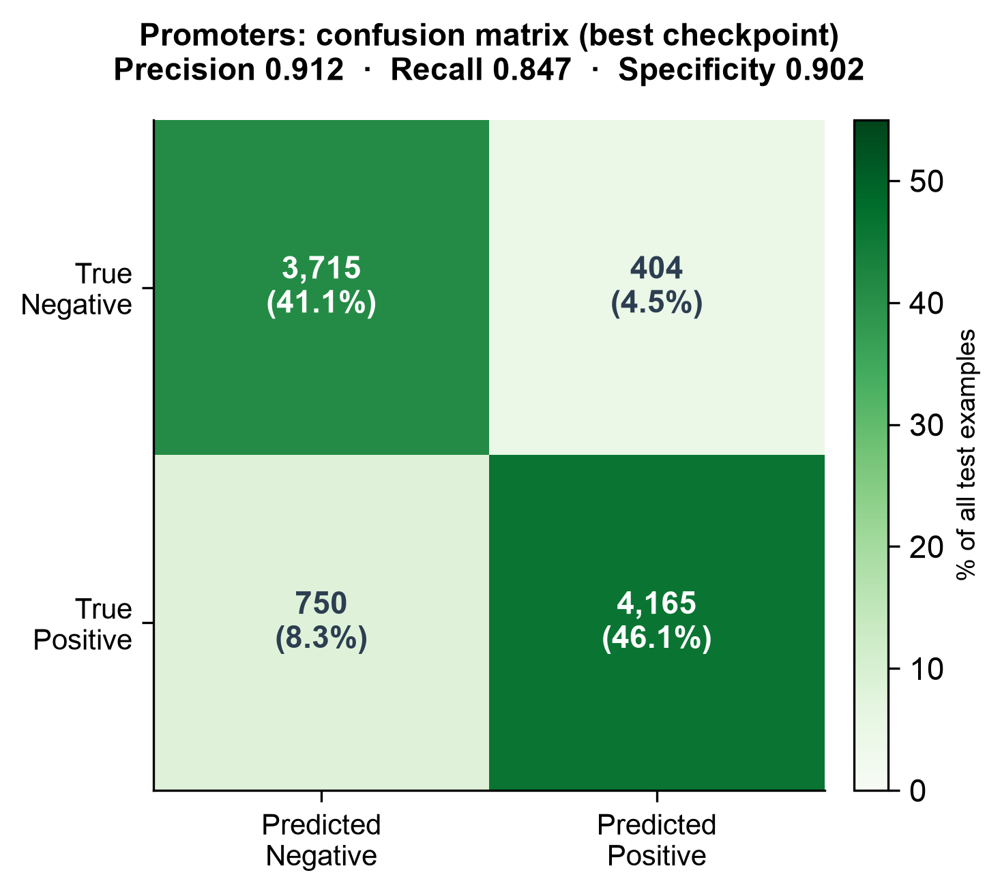
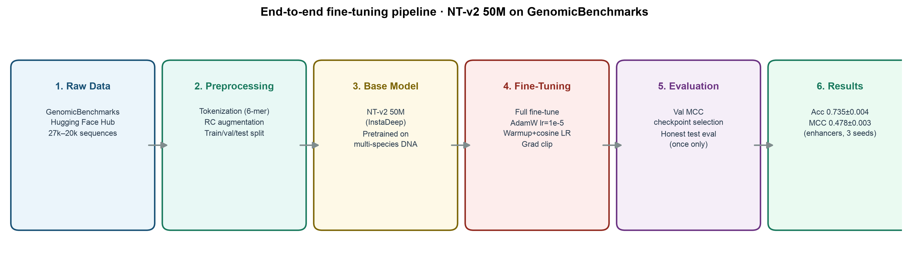
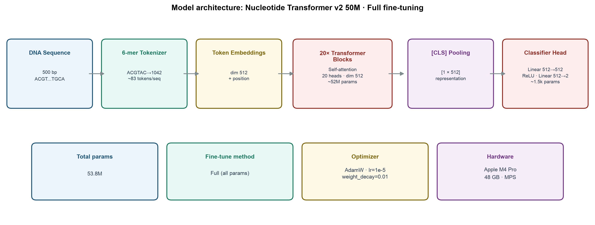

# genome-ft

*Full weight-level fine-tuning of a genomic foundation model, with a leakage-free, multi-seed benchmark.*


-blueviolet)

This repository fine-tunes [Nucleotide Transformer v2 50M](https://huggingface.co/InstaDeepAI/nucleotide-transformer-v2-50m-multi-species) (InstaDeep, 53.8M parameters) on two [GenomicBenchmarks](https://github.com/ML-Bioinfo-CEITEC/genomic_benchmarks) DNA classification tasks. Fine-tuning is performed over all model parameters rather than with LoRA or a frozen backbone. Each stage of the workflow (data preparation, tokenization, training, multi-seed evaluation, and figure generation) is run with a single command.

The objective is to implement and document the complete weight-level adaptation procedure and to report the resulting metrics accurately, with seed-to-seed variance and without train/test leakage.

The problem • Results • What this is / isn't • How it works • Step-by-step • Practical recommendations • Setup • Reproduce • Weights & license

---

## The problem

Many published demonstrations of genomic language models stop at calling an inference API or training a small classification head on a frozen backbone. This leaves open the question of whether the model can be adapted at the weight level: handling tokenization correctly, configuring the optimizer and learning-rate schedule, avoiding common evaluation errors (test-set leakage, single-seed estimates, and overfitting that appears as good performance at the first epoch), and reporting a result that withstands scrutiny.

This repository implements the complete procedure and reports results under a standard evaluation protocol: a train/validation/test split, the test set evaluated **exactly once**, three random seeds for the primary task, the base model measured under the identical pipeline, and all external published values labelled as references rather than controlled comparisons.

---

## Results

| Task | Accuracy | F1 | MCC | Seeds |
|------|----------|-----|-----|-------|
| **Enhancers** (`human_enhancers_cohn`) | **0.735 ± 0.004** | **0.745 ± 0.016** | **0.478 ± 0.003** | 42, 0, 123 |
| **Promoters** (`human_nontata_promoters`) | **0.872** | **0.878** | **0.747** | 42 |

Evaluation protocol: 15% of the training data is held out for validation and used for checkpoint selection; the **test set is evaluated exactly once** on the selected checkpoint, so it is never seen during training. Matthews correlation coefficient (MCC) is reported as the primary metric because it remains informative under class imbalance.

### Fine-tuning lift (base model vs. fine-tuned)



With an untrained classification head, the pretrained backbone performs at chance (enhancers accuracy 0.499, MCC −0.009; promoters accuracy 0.451, MCC −0.044). Full fine-tuning raises accuracy to 0.735 and 0.872 respectively, measured under the identical pipeline.

### Where it lands against published numbers



| Model (enhancers) | Accuracy | Note |
|---|---|---|
| GB-CNN (Grešová et al. 2023) | 0.69 | published reference |
| DNABERT (Ji et al. 2021) | 0.706 | published reference |
| **This project — NT-v2 50M full fine-tune** | **0.735** | measured here, 3 seeds |
| HyenaDNA tiny-1k (Nguyen et al. 2023) | 0.74 | published reference |
| NT-v2 500M (Dalla-Torre et al. 2023) | 0.776 | published reference |
| DNABERT-2 (Zhou et al. 2023) | 0.785 | published reference |

On enhancers, the 50M model performs above the published CNN and DNABERT baselines and below the larger transformers, which is consistent with its parameter count. On promoters, its accuracy (0.872) is comparable to the published GB-CNN (0.85). It does not outperform the 500M models, and is not intended to.

> **On comparisons.** Published values are taken from the source papers and were computed under their own splits and preprocessing. They are reference points, not controlled head-to-head comparisons. The only strictly controlled comparison in this repository is base versus fine-tuned, which uses the identical pipeline.

### Variance across seeds



Three seeds (42, 0, 123) on enhancers give test MCC values of 0.481, 0.478, and 0.474 (σ = 0.003), indicating that the result is stable across initialisations rather than dependent on a single run.

### Confusion matrices (where the errors actually are)

| Enhancers | Promoters |
|---|---|
|  |  |

---

## What this is / what this is not

**What this is**
- A weight-level fine-tune of a pretrained genomic foundation model, updating all 53.8M parameters.
- A reproducible local pipeline: load, tokenize, augment, train, select on validation, evaluate on test once, and plot.
- An honest measurement: base versus fine-tuned on the identical pipeline, three seeds for the primary task, with reported variance.

**What this is not**
- Pretraining from scratch. The base weights come from InstaDeep's NT-v2 50M.
- LoRA or adapter tuning. This updates every layer.
- A state-of-the-art result. A 50M model is not expected to outperform a 500M model, and no such claim is made.
- A clinical or diagnostic tool.

---

## How it works



| Stage | What happens | Why it matters |
|-------|--------------|----------------|
| **1. Raw data** | Load GenomicBenchmarks tasks (20k–27k labelled sequences) | Peer-published benchmark data |
| **2. Preprocess** | 6-mer tokenization, reverse-complement augmentation, 15% validation holdout | RC augmentation is biologically valid (dsDNA is symmetric); the validation split prevents test leakage |
| **3. Base model** | NT-v2 50M, pretrained on multi-species genomes | Provides a genomic prior to adapt from |
| **4. Fine-tune** | Full fine-tune, AdamW lr 1e-5, warmup and cosine schedule, gradient clipping | A lower LR with this schedule limits overfitting in the first epochs |
| **5. Evaluate** | Select the checkpoint by **validation** MCC; evaluate test **once** | Avoids test-set leakage; MCC handles class balance |
| **6. Results** | Multi-seed mean ± SD, base versus fine-tuned, confusion matrices | Provides a reproducible, variance-aware estimate |

### Model architecture



### Design choices

| Choice | What | Why |
|--------|------|-----|
| **Model** | NT-v2 50M (`EsmForSequenceClassification`) | Full HF format, 6-mer tokenization, multi-species pretraining |
| **Fine-tuning** | Full (all params + 2-layer head) | Sufficient at 50M on 48 GB; LoRA not needed |
| **Optimizer** | AdamW, lr 1e-5, weight_decay 0.01 | Lower LR avoids early overfitting seen at 2e-5 |
| **Schedule** | Linear warmup (300 steps) + cosine decay | Stabilises early training |
| **Grad clipping** | max_norm 1.0 | Guards against loss spikes |
| **RC augmentation** | Doubles train set with reverse complements | Biologically valid; standard practice |
| **Validation** | 15% of train held out for checkpoint selection | Test set never seen during training |
| **Evaluation** | Best checkpoint tested once; 3 seeds | Honest, with variance |

---

## Setup

```bash
git clone https://github.com/ankurgenomics/genome-ft.git
cd genome-ft

python -m venv .venv
source .venv/bin/activate
pip install -r requirements.txt

export PYTORCH_ENABLE_MPS_FALLBACK=1   # MPS fallback for unsupported ops
```

**Requirements:** Python ≥ 3.10, PyTorch with MPS (Apple Silicon) or CUDA. `transformers==4.55.2` is pinned because v5.x removes an internal helper that the NT remote code depends on.

---

## Step-by-step: fine-tuning procedure

The method in six steps. Each maps to a stage in the pipeline diagram above and to a specific location in the code.

**Step 1. Obtain benchmark data.**
Load a labelled task from GenomicBenchmarks (20k–27k DNA sequences, binary labels). Using a published benchmark allows the result to be compared against values reported elsewhere.
→ `prepare_data.load_task(...)`

**Step 2. Tokenize the sequences as the model expects.**
NT-v2 uses 6-mer tokenization: the sequence is split into overlapping 6-nucleotide chunks, each mapped to a token id. Use the model's own tokenizer rather than a custom scheme, so that the input matches the pretraining distribution.
→ `prepare_data.py` (tokenizer)

**Step 3. Augment with reverse complements, then split.**
DNA is double-stranded, so a sequence and its reverse complement represent the same biological entity. Adding reverse complements doubles the training set and is biologically valid. A 15% validation set is then held out from the training data before training begins, never from the test set.
→ `prepare_data._augment_reverse_complement(...)`, `--augment_rc`, `--val_frac 0.15`

**Step 4. Fine-tune all parameters.**
Load NT-v2 with a fresh 2-layer classification head and update every parameter with AdamW. A low learning rate (1e-5), a warmup-plus-cosine schedule, gradient clipping, and weight decay are used together to limit overfitting in the early epochs.
→ `train.py`

**Step 5. Select the checkpoint on validation, not test.**
After each epoch, score the validation set and retain the checkpoint with the highest validation MCC. The test set is not used at this stage. This is the step that most affects whether the reported number is honest.
→ `train.py` (save-best on validation MCC)

**Step 6. Evaluate once, with variance.**
Load the selected checkpoint and evaluate the test set exactly once. Report accuracy, F1, and MCC, together with a confusion matrix. Repeat with two or three seeds and report mean ± standard deviation so that the estimate reflects variance across runs.
→ `evaluate.py`, then `nb_figures.py` for the plots

---

## Practical recommendations

Practices that separate a defensible result from one affected by leakage or chance.

### Recommended

| Practice | Rationale |
|---------|----------------|
| **Hold out a validation set from the training data** | Allows checkpoint selection without using the test set |
| **Evaluate the test set exactly once, at the end** | Selecting on the test set invalidates it as an unbiased estimate |
| **Use a low LR (1e-5) with warmup, cosine decay, and gradient clipping** | A 50M model overfits quickly; these settings kept the best epoch at 1–2 |
| **Report MCC, not only accuracy** | MCC remains informative under class imbalance, where accuracy can be misleading |
| **Run multiple seeds and report mean ± SD** | A single run cannot distinguish a real effect from chance; three runs (σ = 0.003 here) characterise the variance |
| **Measure the base model on the identical pipeline** | Provides a controlled before/after comparison, attributing the gain to fine-tuning rather than preprocessing |
| **Augment with reverse complements** | Biologically valid additional data, since double-stranded DNA is symmetric |
| **Check the base-model licence before redistributing weights** | CC-BY-NC-SA-4.0 here means publishing code rather than weights |

### Not recommended

| Practice | Consequence |
|---------------|-----------------|
| **Tuning or selecting on the test set** | Data leakage; the reported number will not reproduce under independent evaluation |
| **Trusting epoch-1 numbers or simply training longer** | Validation MCC peaked at epoch 1–2 and then declined; additional epochs reduced performance |
| **Reporting a single seed as the result** | Skill cannot be separated from chance without an estimate of variance |
| **Treating published numbers as controlled comparisons** | Different splits and preprocessing make them reference points, not head-to-head results |
| **Quoting accuracy alone on imbalanced data** | A model can show high accuracy while MCC reveals limited learning |
| **Using a custom tokenization** | The model was pretrained on 6-mers; a mismatched scheme discards the pretraining prior |
| **Redistributing weights without reading the licence** | NonCommercial and ShareAlike terms propagate to every derivative |
| **Overclaiming** | A 50M model is not state of the art; report only what was measured |

---

## Reproduce

### Quick smoke test (~2 min), verifies the full pipeline runs
```bash
PYTORCH_ENABLE_MPS_FALLBACK=1 python train.py \
    --task human_enhancers_cohn \
    --limit 500 --epochs 2 --eval_limit 500 \
    --out_dir ./checkpoints_smoke
```

### Full enhancers run (one seed)
```bash
PYTORCH_ENABLE_MPS_FALLBACK=1 python train.py \
    --task human_enhancers_cohn \
    --epochs 4 --lr 1e-5 --warmup_steps 300 \
    --weight_decay 0.01 --max_grad_norm 1.0 \
    --augment_rc --val_frac 0.15 --batch_size 16 \
    --seed 42 \
    --out_dir ./checkpoints_enh_s42 \
    --metrics_out ./metrics_enh_s42.json
```
Repeat with `--seed 0` and `--seed 123` for the multi-seed result. The best checkpoint (by validation MCC) is saved to `<out_dir>_best/` automatically.

### Promoters
```bash
PYTORCH_ENABLE_MPS_FALLBACK=1 python train.py \
    --task human_nontata_promoters \
    --epochs 4 --lr 1e-5 --augment_rc --val_frac 0.15 \
    --out_dir ./checkpoints_pro_s42 \
    --metrics_out ./metrics_pro_s42.json
```

### Evaluate (base vs. fine-tuned, with confusion matrix)
```bash
PYTORCH_ENABLE_MPS_FALLBACK=1 python evaluate.py \
    --task human_enhancers_cohn \
    --checkpoint_dir ./checkpoints_enh_s42_best
```
Writes `eval_report.json` with base-vs-fine-tuned metrics, confusion matrix, and a per-class report.

### Regenerate all figures
```bash
python nb_figures.py
```
Produces the ten publication-style figures in `docs/figures/`.

---

## Training flags

| Flag | Default | Description |
|------|---------|-------------|
| `--task` | `human_enhancers_cohn` | GenomicBenchmarks task name |
| `--checkpoint` | NT-v2 50M | HF model id or local path |
| `--epochs` | 3 | Training epochs |
| `--limit` | 0 (all) | Cap training examples (0 = full dataset) |
| `--lr` | 1e-5 | Peak learning rate |
| `--warmup_steps` | 300 | Linear warmup steps before cosine decay |
| `--weight_decay` | 0.01 | AdamW L2 regularisation |
| `--max_grad_norm` | 1.0 | Gradient clipping (0 to disable) |
| `--augment_rc` | off | Enable reverse-complement augmentation |
| `--val_frac` | 0.15 | Fraction of train held out for validation |
| `--batch_size` | 16 | Training batch size |
| `--seed` | 42 | Random seed |
| `--out_dir` | `./checkpoints` | Final checkpoint directory |
| `--metrics_out` | `./metrics_log.json` | Per-epoch metrics JSON |

---

## Project structure

```
genome-ft/
├── train.py          # Training loop (AdamW, warmup+cosine, val-based save_best, test-once)
├── prepare_data.py   # Data loading, 6-mer tokenization, RC augmentation, val split
├── evaluate.py       # Base vs. fine-tuned, confusion matrix, eval_report.json
├── nb_figures.py     # Ten publication-style figures
├── requirements.txt
├── MODEL_CARD.md     # Hugging Face-style model card
├── LICENSE           # MIT (code)
├── docs/figures/     # Generated figures
└── README.md
```

---

## Hardware & runtime

| Hardware | ~Time per epoch (full task) |
|----------|------------------------------|
| Apple M4 Pro 48 GB (MPS) | ~70–110 min |
| NVIDIA A100 / H100 | ~5–10 min (estimate) |

Throughput is approximately 0.45 batches/s at batch size 16 on MPS; several ESM operations fall back to CPU via `PYTORCH_ENABLE_MPS_FALLBACK=1`. A full three-seed enhancers sweep together with promoters takes roughly one day of wall-clock time on the M4 Pro, or a few hours on a single modern GPU.

---

## Weights & license

### Why the fine-tuned weights are not published here

The base model, **NT-v2 50M**, is released by InstaDeep under **[CC-BY-NC-SA-4.0](https://creativecommons.org/licenses/by-nc-sa/4.0/)** (Attribution, NonCommercial, ShareAlike). A fine-tune is a derivative work and inherits those terms.

This repository publishes the code and the full results but does not redistribute the trained weight files, for the following reasons:

1. **The ShareAlike and NonCommercial terms would attach to the weights.** Redistribution is permitted only under the same CC-BY-NC-SA-4.0 licence and only for non-commercial use. Hosting a model file would invite commercial reuse that cannot be controlled, so the weights are not distributed.
2. **The result is reproducible from this repository.** Every hyperparameter, seed, and split is fixed and documented above, so the checkpoints can be regenerated from the code. The weights are a byproduct; the contribution is the pipeline and the evaluation.
3. **It keeps attribution unambiguous.** Credit for the base model remains with InstaDeep and credit for the benchmarks remains with the GenomicBenchmarks authors. This repository claims only the adaptation procedure and the evaluation.

This approach respects the upstream licence and avoids re-licensing risk while preserving reproducibility, since the results can be regenerated from the code.

To obtain the checkpoints, run the commands in [Reproduce](#reproduce). If a future base model is released under a permissive licence, the same pipeline produces a directly publishable artifact without modification.

### Licences

| Component | Licence |
|-----------|---------|
| **Code in this repository** | MIT — see [LICENSE](LICENSE) |
| **Base model (NT-v2 50M)** | CC-BY-NC-SA-4.0 (InstaDeep) |
| **Any fine-tuned weights you produce** | CC-BY-NC-SA-4.0 (inherited), non-commercial |
| **GenomicBenchmarks data** | per the GenomicBenchmarks project |

This is a personal open-source project, developed independently in a personal capacity. It is not affiliated with, endorsed by, or representative of any current or former employer, and uses only public models and public benchmark datasets. All views and results are the author's own.

---

## Related work

Recent work in this area addresses the post-training dynamics of biological sequence models. One example is Fesser, Zhang, Li, Zitnik et al., *How Post-Training Shapes Biological Reasoning Models* ([arXiv:2606.16517](https://arxiv.org/abs/2606.16517), 2026), which trains and evaluates more than 100 models across DNA, RNA, and protein modalities and across continued pretraining, supervised fine-tuning, and reinforcement-learning stages. That is a large research program, whereas this repository is a single controlled fine-tuning study. The two differ substantially in scope.

Two points of contact are worth noting:

- **Performance does not increase monotonically with training.** Finding 1 of that study reports that supervised fine-tuning improves in-domain accuracy while out-of-domain performance peaks early and then declines. In this project, validation MCC peaked at epoch 1–2 and then decreased as the training loss continued to fall (visible in the per-epoch logs and the training-curve figure). This is the in-domain counterpart of the same effect, namely overfitting beyond the early epochs, and it motivates the use of a low learning rate (1e-5) and validation-based checkpoint selection rather than longer training.

- **Licence-aware release is part of the process.** The backbones used in that study permitted weight redistribution, so the authors could publish checkpoints directly. NT-v2 is licensed CC-BY-NC-SA-4.0, so the appropriate choice here is to publish reproducible code rather than redistribute weights (see [Weights & license](#weights--license)).

The general point is that, independent of scale, the relevant discipline is evaluation under a clean protocol: no leakage, multiple seeds, reported variance, and claims limited to what was measured.

---

## References

**How Post-Training Shapes Biological Reasoning Models** — Fesser, L., Zhang, H., Li, M. M. et al. arXiv:2606.16517 (2026).

**Nucleotide Transformer** — Dalla-Torre, H. et al. *The Nucleotide Transformer: Building and Evaluating Robust Foundation Models for Human Genomics.* bioRxiv (2023).

**GenomicBenchmarks** — Grešová, K., Martinek, V., Čechák, D. et al. *Genomic benchmarks: a collection of datasets for genomic sequence classification.* BMC Genomic Data (2023).

**DNABERT** — Ji, Y. et al. (2021) · **DNABERT-2** — Zhou, Z. et al. (2023) · **HyenaDNA** — Nguyen, E. et al., NeurIPS (2023).

---

Built and maintained by **Ankur Sharma**.

*This is a personal open-source project, developed independently in a personal capacity. It is not affiliated with, endorsed by, or representative of any current or former employer, and uses only public models and public benchmark datasets. All views and results are the author's own.*
